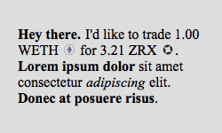
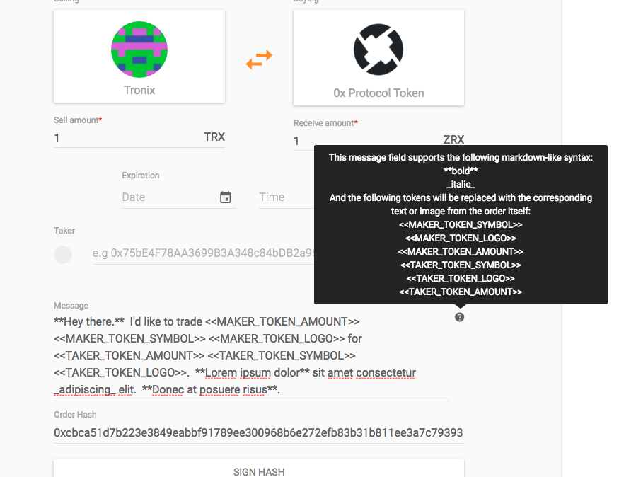
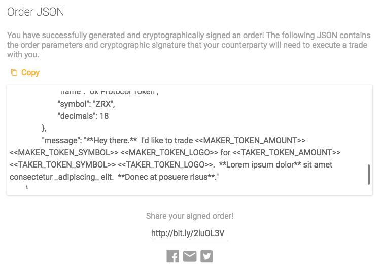
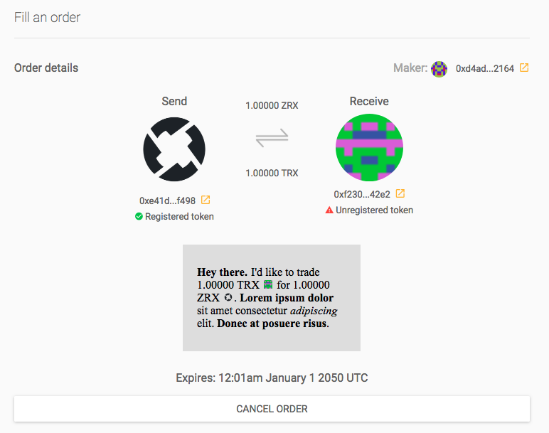

0x-order-image-generator
========================

This is a simple server API for rendering 0x order messages, saving them to disk, and providing an endpoint for later fetching them. It uses the `wkhtmltoimage` command line tool (via an npm module) to perform the rendering with support for text formatting and images. The following markdown-like syntax and order data tokens are supported:

- `**bold**` -> __bold__
- `_italics_` -> *italics*


- `<<MAKER_TOKEN_SYMBOL>>` -> the currency symbol (e.g. ETH) of the maker token
- `<<MAKER_TOKEN_AMOUNT>>` -> the properly formatted amount of the maker token
- `<<MAKER_TOKEN_LOGO>>` -> a small, inline version of the maker token's logo image


- `<<TAKER_TOKEN_SYMBOL>>` -> the currency symbol (e.g. ETH) of the taker token
- `<<TAKER_TOKEN_AMOUNT>>` -> the properly formatted amount of the taker token
- `<<TAKER_TOKEN_LOGO>>` -> a small, inline version of the taker token's logo image

### Example
The top-level image file `example.png` (shown below) was generated using the following message text and params:



```
**Hey there.**  I'd like to trade <<MAKER_TOKEN_AMOUNT>> <<MAKER_TOKEN_SYMBOL>> <<MAKER_TOKEN_LOGO>> for <<TAKER_TOKEN_AMOUNT>> <<TAKER_TOKEN_SYMBOL>> <<TAKER_TOKEN_LOGO>>.  **Lorem ipsum dolor** sit amet consectetur _adipiscing_ elit.  **Donec at posuere risus**.
```

```
{
  orderHash: 'example',
  makerTokenSymbol: 'WETH',
  takerTokenSymbol: 'ZRX',
  makerTokenAmount: '1.00',
  takerTokenAmount: '3.21',
  makerTokenLogo: 'https://0xproject.localhost:3572/images/token_icons/ether_erc20.png',
  takerTokenLogo: 'https://0xproject.localhost:3572/images/token_icons/zero_ex.png'
}
```

#### Order generation flow
Below are a few screenshots of the updated order generation & fill flow with support for the order messages. The updated fork of the 0x-project repo is here: [`TheRealest/0x-project`](https://github.com/TheRealest/0x-monorepo/) (everything is on the `feature/opengraph-orders` branch).

##### Generate order page



##### Order message JSON



##### Fill order page



### Dependencies
The server is written in NodeJS and dependencies can be installed with a good old:

```bash
npm install
```

However, because of the reliance on the native tool `wkhtmltoimage`, it also needs to be installed for the rendering to work. It can easily be downloaded off the website: https://wkhtmltopdf.org/.

Finally, if you don't already have it you will need `coffeescript` to run the server code. Another easy install with:

```
npm install -g coffeescript
```

### Running the server
Just give it a good old:

```
coffee index.coffee
```

to get the thing running! It runs on port 3000, which is where my changes to the 0x-project website know to look. Images will be stored locally in the `images/` directory, which will need to be created if it does not exist.
